# DevOps (Demo Script)

## Demo Overview

### High-level flow

DevOps is the union of People, Process and our Products to enable continuous delivery of value to your end users.  In todays world, the speed of business is so rediculously fast that this DevOps mindset, continously delivering value to your end user, is absolutely vital.  If you have not adopted this mindset, your competitors either have or will and they will quickly out innovate you and render you obsolete.  Microsoft has the products and services that easily enables full end to end DevOps coverage. That product is Visual Studio Team Services.  VSTS provides full DevOps coverage with the following:

1.  Agile Planning/Work Item Tracking.  VSTS has the ability to track any unit of work in
    an agile fashion for a software project.  This includes things like, bugs, user stories,impediments etc.

2.  Source Control. VSTS has 2 source control systems.  A centralized version control
    system and a distributed version control system.  The distributed version control system is git.  Not some weird microsoft only version of git, but just the open source version of git, implemented in VSTS.

3.  Build (Continuous Integration).  A automated build system that can be easily customized 
    to do anything.  This build system can build any language on any platform

4.  Test.  VSTS has a full end to end testing platform from unit testing, to manual testing,
    to automated testing, to load testing.

5.  Deploy (Continuous Delivery). VSTS has a fully customizable deployment system that can
    take your binaries and deploy them onto anything, anywhere.

6.  Feedback loop with Application Insights.

Visual Studio Team Services is everything you need to for your software project.

### Key Takeaways

1.  Microsoft has products and services that give you full end to end DevOps
    coverage. Visual Studio Team Services. VSTS is everything you need to build software in any language for any platform

2.  You can build out your CI/CD pipelines easily and make them do just about anything.

## Demo Setup
See the following link for detailed instructions on building out this demo

http://abelsquidhead.com/index.php/2016/04/06/setting-up-a-devops-demo-using-vsts-and-azure-or-devops-nirvana-with-vsts-and-azure-part-1/

## Demo 

1.  Start up slide deck

    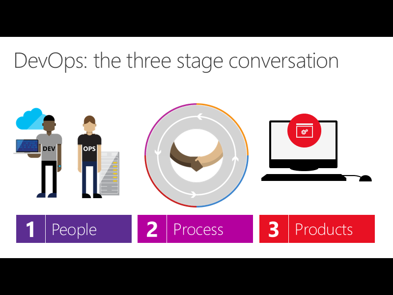  

    >**Talking Point**: At Microsoft, DevOps it the union of people, process and our products to enable the continuous delivery of value to our end users.  

2.  Next slide

    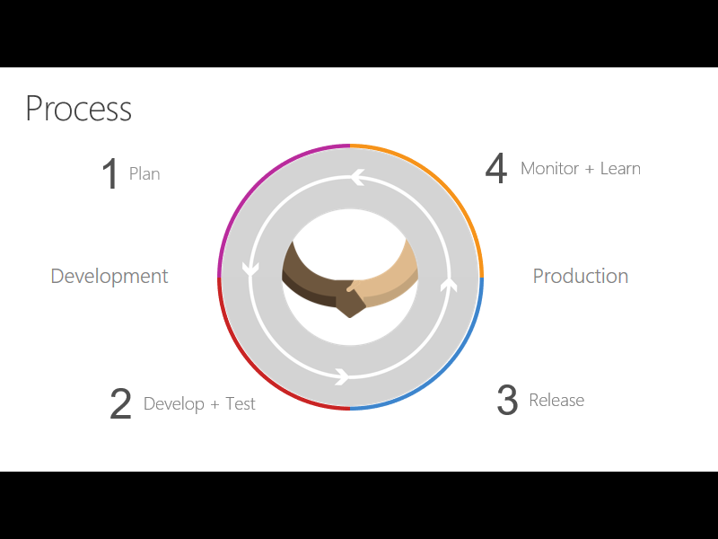  

     >**Talking Point**: This is not an easy thing to do, to continuously deliver value to our end users.  We need to make sure we have a process that will let us iterate fast enough, yet still deliver code of high enough quality, that is of value.  We need quick iterations.  Where changes to the code is easily tracked.  Where every developer checkin can be verified, and is automatically built and unit tests are run.  And if everything looks good and all unit tests pass, then we need an automated system that picks up those builds and starts delivering our changes to our different environments.  Dev, QA, so on and so forth, all the way out to production.  And we need this system to be automated because we need to make sure the deployments are repeatable, and consistent every single time so no human deployment error is introduced.  And once our code hits production, it doesn't end there.  We need to monitor our app in production and gather telemetry like is my app up or down, is my app performing well, and what are users really doing in my app.  Because telemetry like that can let us know if we are delivering **value**, which should help drive what we do in the next iteration.

3. Next slide

    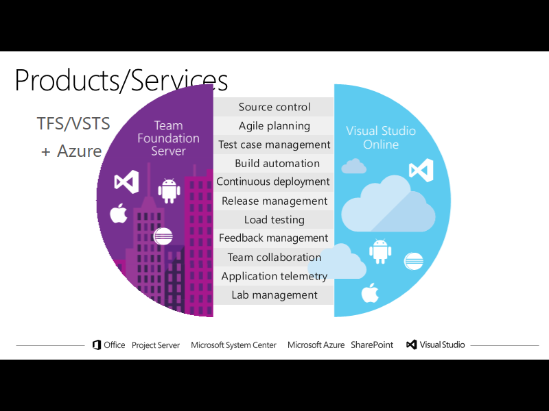 

    >**Talking Point**: To do all of this correctly is extremly complicated so we need to make sure we have the right tools and services.  Visual Studio Team Services gives us that.  It's everything you need to build software.  In any language.  For any platform.  Visual Studio Team Services gives us full end to end DevOps coverage.

4. Next slide

    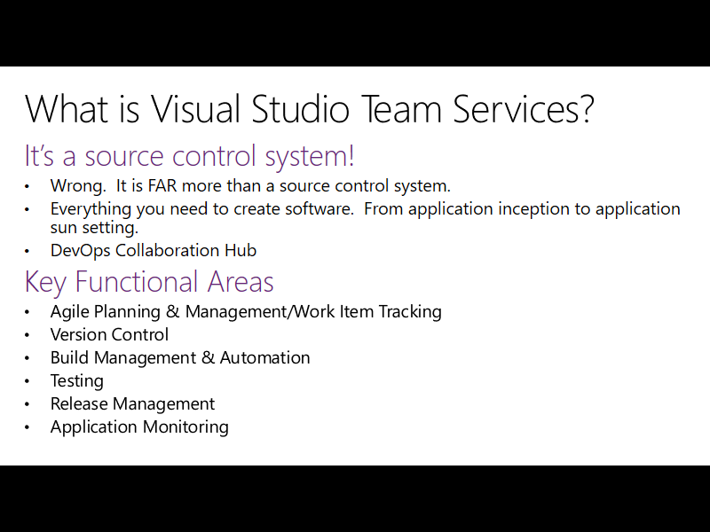

    >**Talking Point**: To do this, Visual Studio Team Services has 7 key areas.  
    
    First, there is the Agile Planning or the Work Item Tracking area.  In VSTS, you have the ability to track any unit of work in a software project.  Like bugs, user stories, features, or impedements.  There is also a full set of visual tools that let you manage all your work by dragging and dropping like the product backlog, sprint backlogs, kanban boards and delivery plans.  
    
    Next is the Version Control system.  VSTS has both a distributed version control system and a centralized version control system.  The distributed version control is just Git.  Not some weird Microsoft only version of Git, but the open source implementation of Git. 
    
    Next, VSTS has an automated build system that is super easy to customize and make it do whatever you want.  Using the build system in VSTS, you can quickly create builds for any language on any platform.  
    
    There is a full testing platform in VSTS, from unit testing, to manual testing all the way automated ui testing and load testing.  
    
    With VSTS, you also have Release Management, where you have a fully customizable deployment system where you can deploy anything, anywhere.  
    
    And finally, with Application Insights, you can monitor your apps in production and get the telemetry that you need.  

5.  Go to the demo VM

    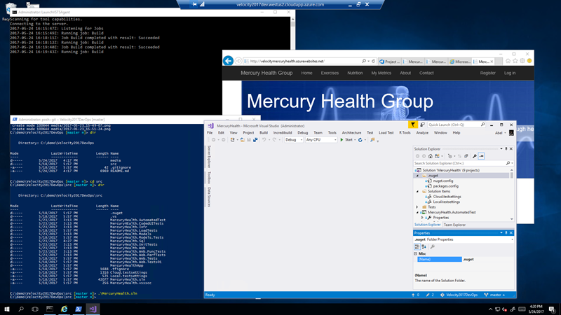 

    >**Talking Point**: Let's go and see VSTS in action

6.  Go to the browser which is opened to the 5 tabs. vsts, dev, qa, bluegreen and prod., click on the dev environment tab, then click on Exercise and the Nutrition, then click through dev, qa, bluegreen and prod environment

    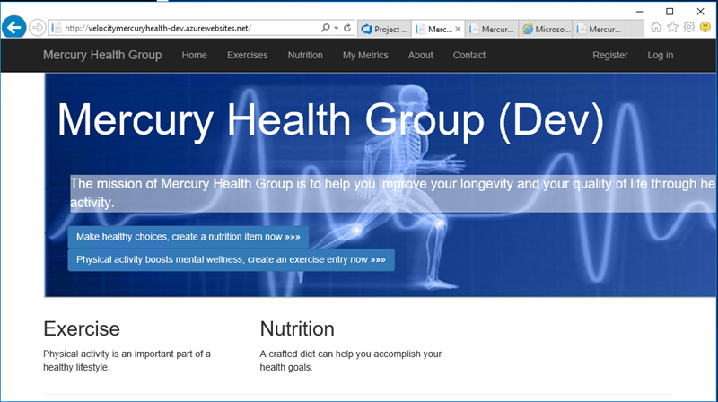

    >**Talking Point**: For this demo, we will be working with the web app Mercury Health.  It's a typical health tracking appication.  It tracks the food that you eat throughout the day and also the exercise that you do.  And based on calories vs calories out, it draws pretty graphs and tells you if you are healthy or not.  For this demo, we also have 4 seperate but identical environments.  Dev, QA, BlueGreen and Prod 

7.  Go to the dev environment, click on Nutrition tab, then click on edit for the last item

    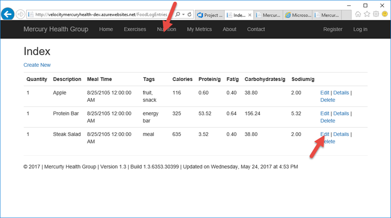

    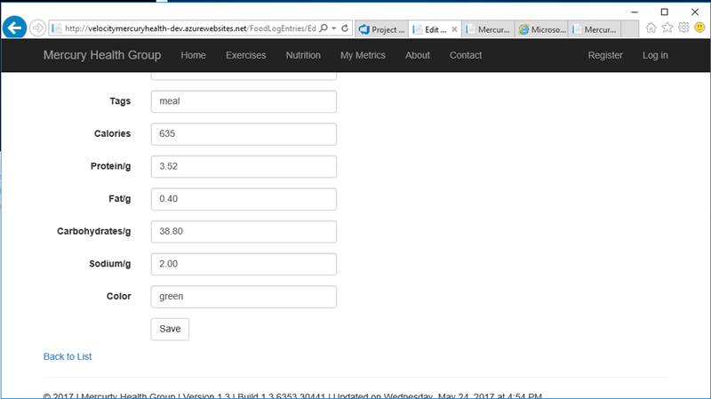

    >**Talking Point**: Now in this app, one of the properties that we are tracking for the food item is the Color of the food item.  Now that seems totally stupid, so we are going to remove that.

8.  Go to the first tab and click the work tab, click the Backlog link.  Walk through the talking points

    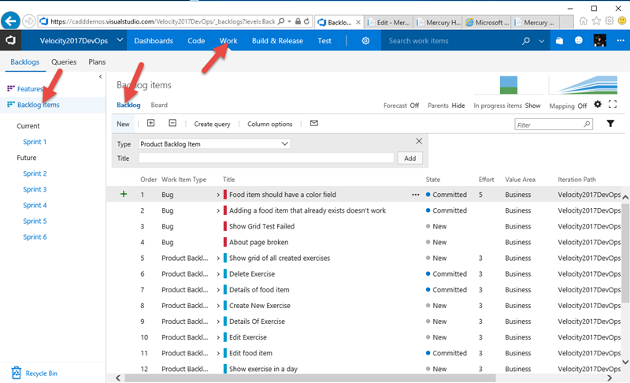

    >**Talking Point**: In VSTS, we have the ability to track all units of work with amazing visual stools.  Here we have the product backlog, where we can easily priortize items by dragging and dropping.  We can also add new bugs and product backlog items and also drag items to individual sprints.  Now the product backlog is fantastic for prioritizing work and also to do rudimentary planning.  But it's not good at actually seeing what work is being done and what's happening with the work items.  And that's where the Kanban boards come in.

9.  Click on the Board link and walk through the talking point.

    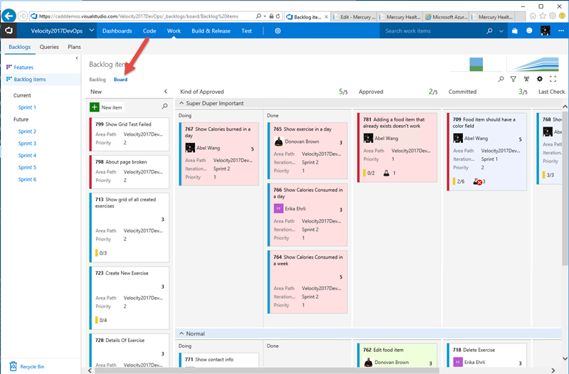

    >**Talking Point**: In VSTS, you get a fully customizable Kanban board.  You can customize everything.  From the columns, the the rows to what is displayed on the cards.  You can even create rules based on any field of a work item so I created some rules where if it's a priority 1 work item, it turns the card red.  If a work item is assigned to me, it turns the card blue.  And if a work item is assigned to Donovan, I turn the card green.  And of course everything is drag and droppable.  Now in the commited column, we see work item 709, Food item should not have a color field.  

10. Click on the elipses on bug 709 and select New Branch

    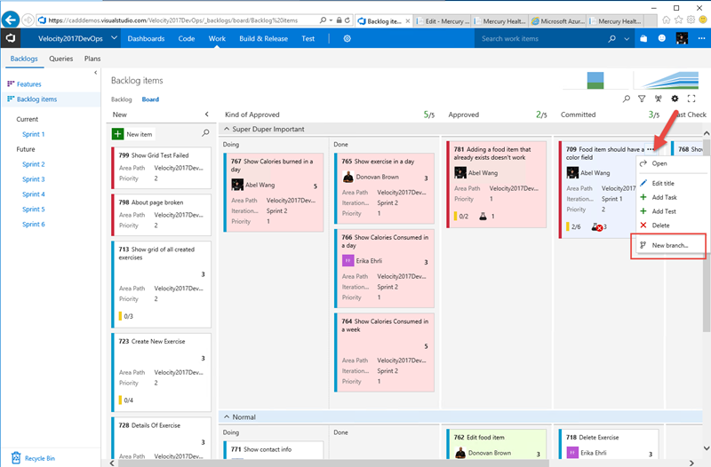

    >**Talking Point**: Let's go ahead and make our changes so we can select this work item and create a new branch for us to work in.

11. Type in a suitable name for your branch like AddColorToFoodBranch or RemoveColorToFoodBranch and click Create branch

    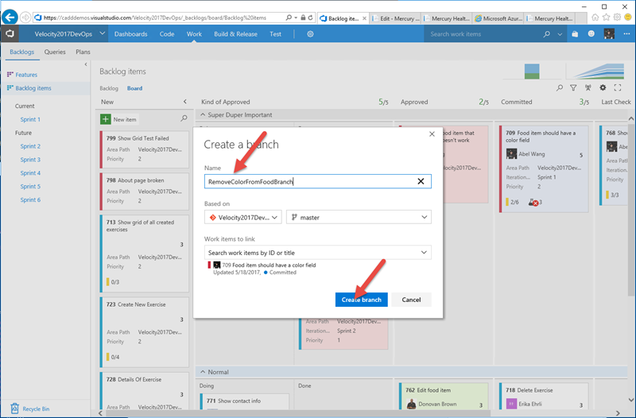

    >**Talking Point**: Let's give this branch a name and you can see the work item is automatically attached to this particular branch.  You can add more work items manually if you want to. 

12. Just show the page   

    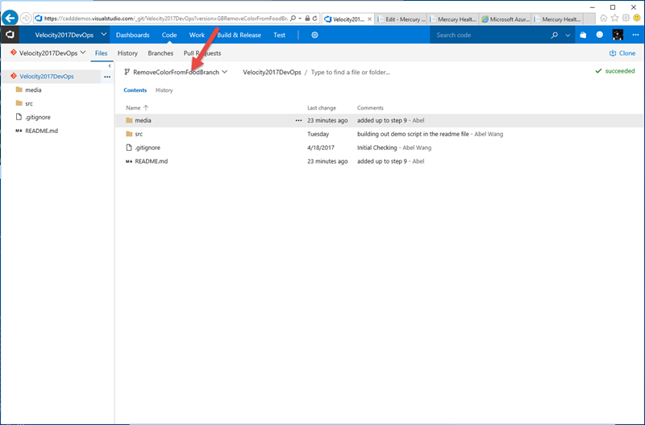

    >**Talking Point**: And just like that, we created a Feature Branch for our dev to work in.

13. Click on you powershell box, type
    
    git pull  
    git checkout RemoveColorFromFoodBranch

    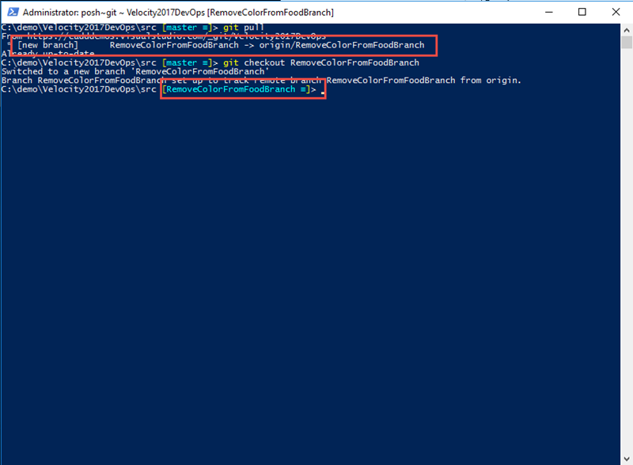

    >**Talking Point**: As a dev, let's go ahead and pull that branch down and we'll go ahead and checkout the branch

14. Go to Visual Studio.  Open the FoodLogEntries.sql design page, highlight the Color field (or add a color field with data type nvarchar(50) and press delete

    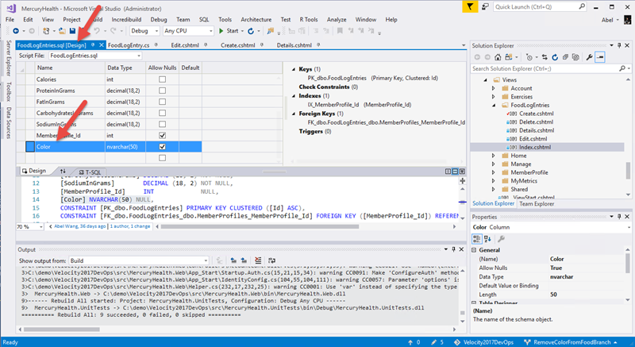

    >**Talking Point**: Now let's go and make our changes.  To remove (or add depending on what state the demo is left in) the color field, we need to make changes.  First , we need to change our DB schema so let's go into our DB project and remove the color field

15. Open the FoodLogEntry.cs file, highlight lines 43 and 45 and comment them out (or the opposite depending on state of the demo). 

    Open the Edit.cshtml file and comment out lines 92-99 (or the opposite).  
    
    Open Create.cshtml and comment out (or the opposite) lines 92-98. 
    
    Open Details.cshtml and comment out lines 86-89

    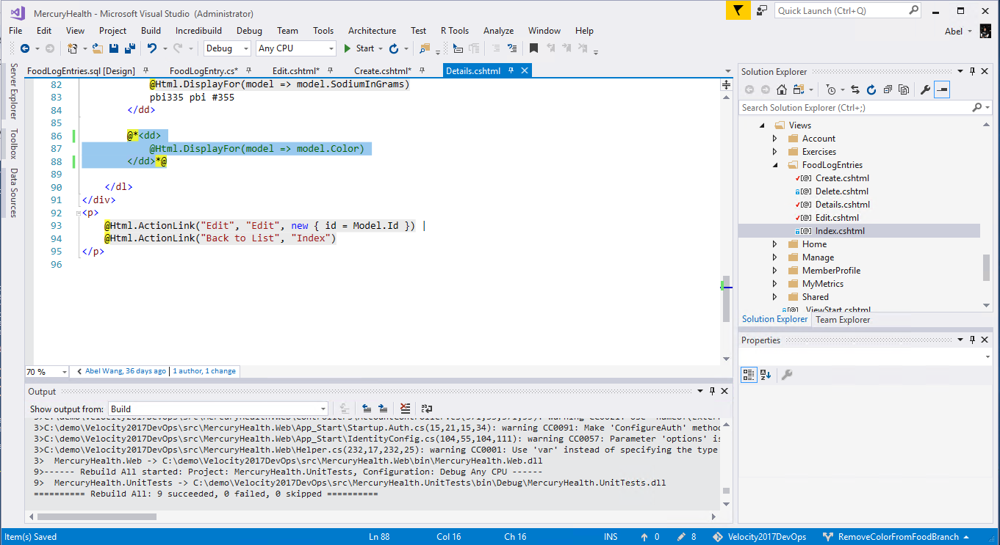

    >**Talking Point**: We also need to make some changes to the code.

16. Go to powershell command box. type  
    
    git status  
    git add *   
    git commit -m "removed color from db schema, removed color from web code" 
    git push  

    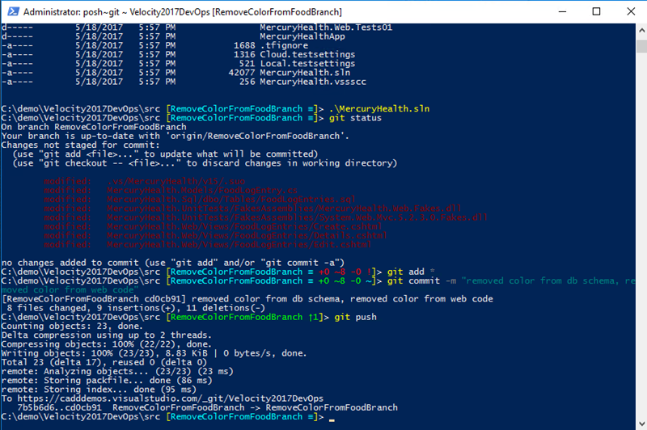

    >**Talking Point**: Ok, now let's go ahead and check all of our code back into VSTS.  You can obviously do this from visual studio, but I'm really old school when it comes to git and I love using the command line. 

17. Go back to the browser with VSTS and refresh the code page

    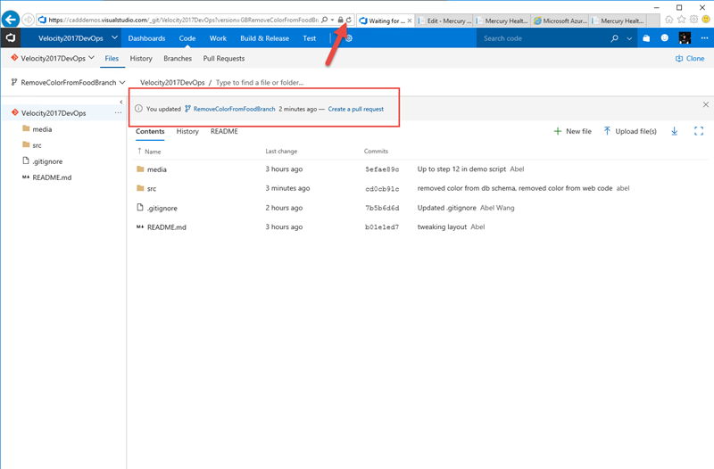

    >**Talking Point**: Going back to VSTS, we can see that we just checked in the RemoveColorFromFoodBranch.  It's asking us if we want to do a code review/pull request and since we want to follow good DevOps guidelines, of course we want to do a pull request so let's click on the link

18. Click the Create a pull request link, then slowly scroll through everything on the screen

    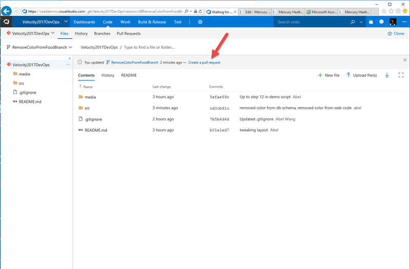

    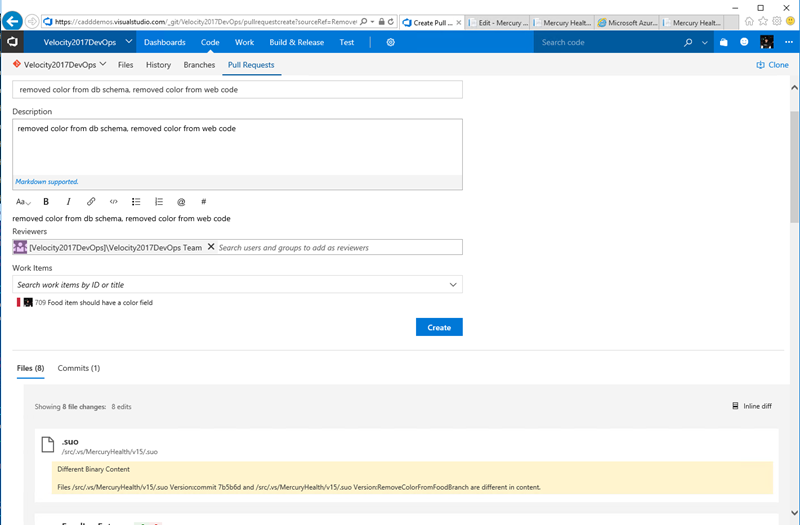

    >**Talking Point**: We can give our pull request a title and a description.  We can also manually assign who the reviewers are.  We can even set up VSTS so that it automatically assigns people based on the directory the code is coming from.  Our work item is automatically attached to this pull request.  We can also manually add more work items if we need to.  Finally, we can see every file that was touched.

19. Click on the Create button, on the new page that loads, go ahead and click on Files1

    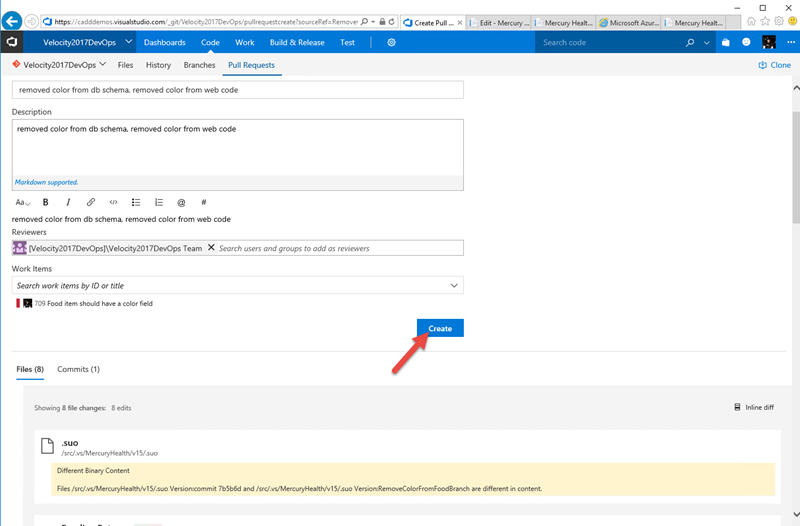

    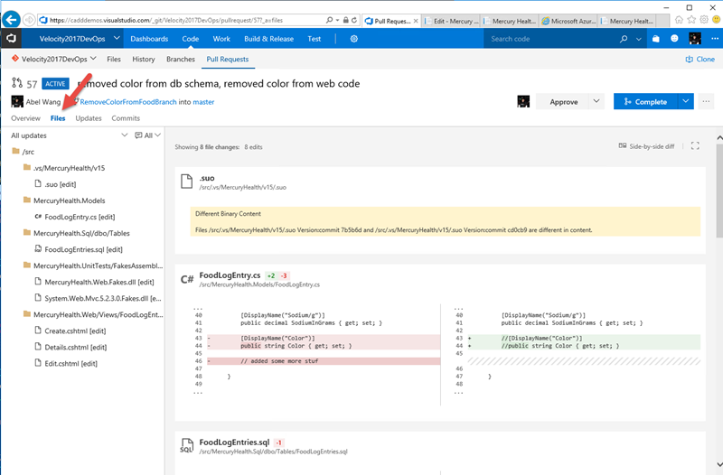

    >**Talking Point**: So now, in our pull request, we can see each individual file that has changed and what has changed.

20. Hover next to a line and click comment icon and leave a comment, then reply to the comment

    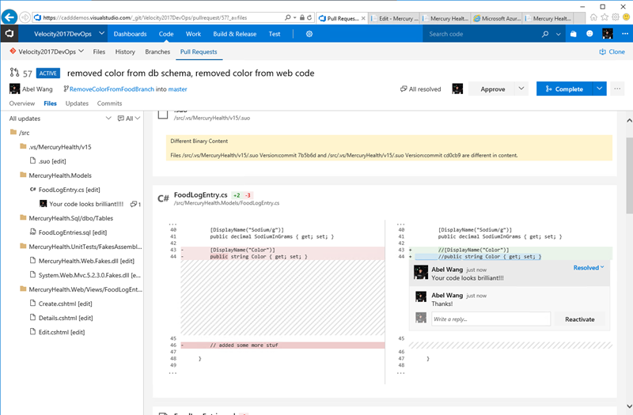

    >**Talking Point**: We can start leaving comments, and reply to comments

21. Select Approve and Complete, then make sure Delete branch and squash changes are selected and click Complete merge 

    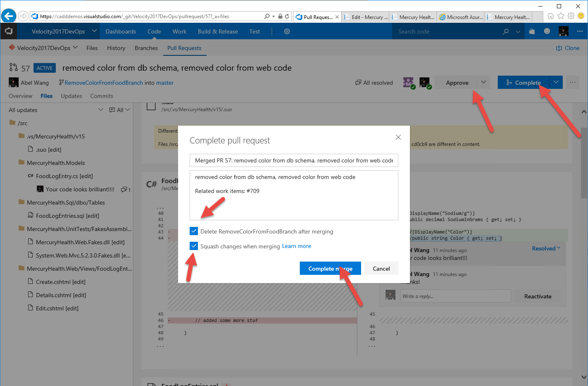

    >**Talking Point**: We can totally have a back and forth for this code review and eventually, we can either approve the change or reject it.  Let's go ahead and approve it.  We also have the option to delete this feature branch automatically and we can even squash all of our changes so the commit is super clean and easy to read.

22. Click on Build & Release and select Builds, then click on the build that was just queued

    

    >**Talking Point**: Completing the pull request merges the code back into master, which kicks off our build.  Here we can see in real time the build taking place.

23. Click on Edit build definition, show off task libraries

    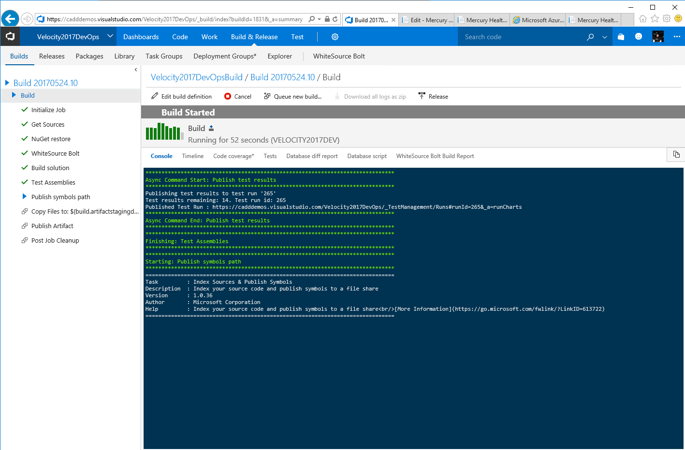

    >**Talking Point**: This build system is basically a glorified task runner where it does one task, after another, after another.  Out of the box, VSTS comes with a huge set of tasks that it can do. If you need your build to do something that doesn't exist out of the box, you can Go to the Marketplace where the community has created a library of tasks.  If what you want to do doesn't exist in the Marketplace, you can easily create your own custom task.  A custom task is nothing more than either powershell or node js.  You bundle it together with the artifacts that you need, upload it to VSTS and voila, you have created your own custom task.  What that means is if you can script something, you can get VSTS to do it.  Or in other words, you can literally make this build system do whatever you want.

24. Navigate to the build report

    
    >**Talking Point**: Once the build finishes, you can see the build report.  In this build report, you see all the build issues, you see the changesets that were build, the associated work items, the unit tests that were run as well as the code coverage and even where this build got release to.

25. Navigate to the deployment

    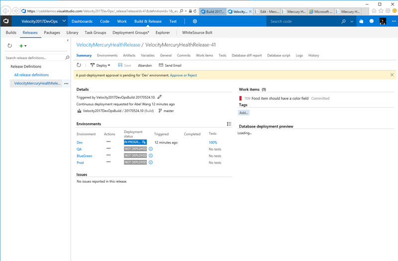

    >**Talking Point**: We have already set up our CI/CD pipeline so if this build is successful, it starts deploying in our CD pipeline.  Here we can see the deployment happen in real time as well.  In this demo, we actually are using an agent running on this dev box.  This is only for demo purposes so you can see what's happening. It takes a while for the deployment to finish so let's see how we set up a deployment.

26. Navigate to the edit of the deployment

    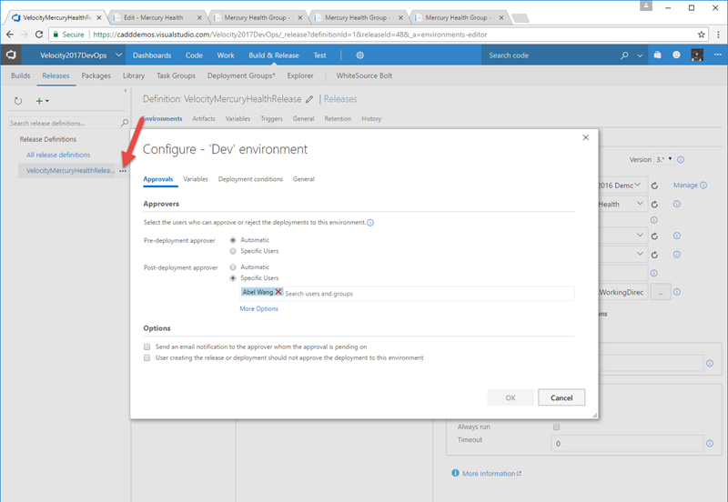
    
    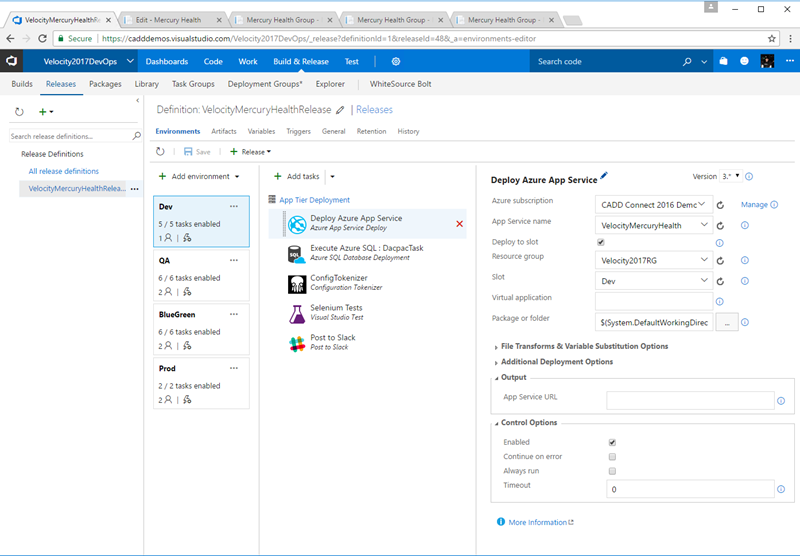

    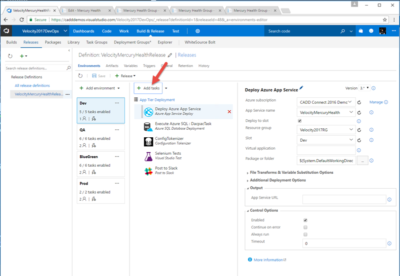

    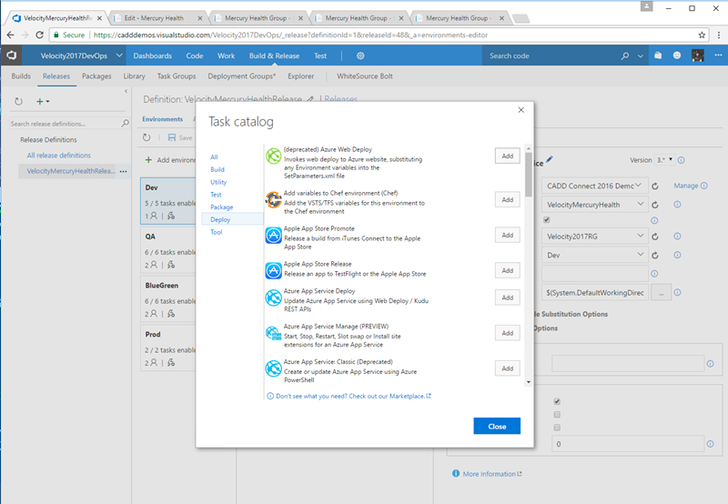

    >**Talking Point**: The first thing you do is you define all of your environments.  Then for each environment, you get to set quality gates going into the environment and going out.  You can set as gate keepers individuals, or groups of people.  Then for each environment, you set the tasks that you want the deployment to do.  In my example, I'm deploy my web app to azure, then performing a quick web test to make sure my app deployed successfully.  Then I go and deploy my database schema changes.  And finally, I run through a set of automated ui tests.  Once again, out of the box, you have a full set of tasks that can do all sorts of stuff.  But if you can't find the task that you need out of the box, go to the Marketplace and see if the community has already built what you need.  And if you can't find it in the Marketplace.  You can easily create your own custom task.  Just like the build, a custom task is nothing more than powershell or node js.  So once again, you can create tasks that can make this deployment system do anything.  As the your app is deployed in each environment, people will need to approve it so it can flow through the approval gates until eventually it reaches all the way to production.

27. Navigate to the deployment report

    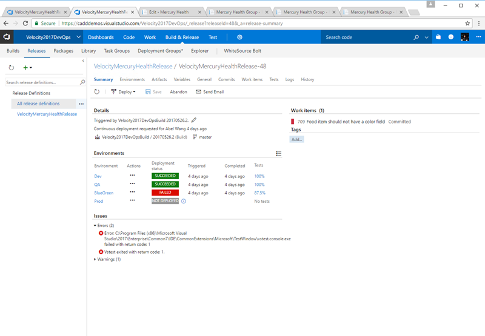

    >**Talking Point**: It takes a while for the deployment to go through each system, so let's look at a deployment that we did earlier.  

28. Show tests, and links back to build report

    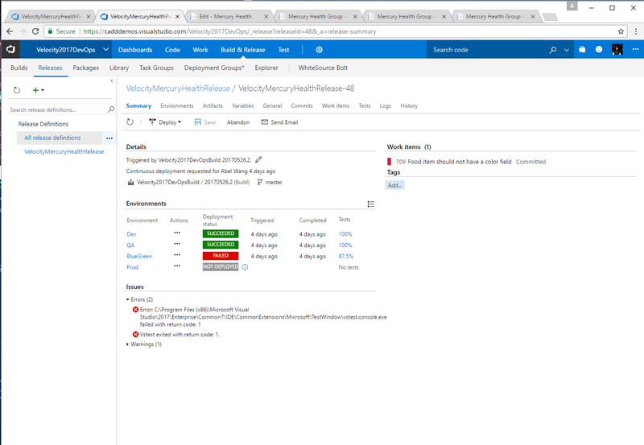

    

    

    >**Talking Point**: From the deployment report, we can see that we deployed to dev and qa and the deployment failed in BlueGreen.  We can see some tests failed in BlueGreen.  Clicking on the test links shows us the failed tests and why the tests failed.  If we are wondering what was actually deployed, the work item's associated with this deployment are shown as well as we are linked back to the buil report, which shows everything that has happened to the specific build. So there you have it.  VSTS.  Everything you need to build software for any platform.  From Work Item Tracking, to Source Control, Build, Test and Release.

## Video Walkthrough
Here is a [video walkthrough](https://cadddemos.visualstudio.com/_git/Velocity2017DevOps?path=%2FVelocity2017.mp4&version=GBmaster&_a=contents) of the demo

## Reset
Resetting the demo just requires you to pull down the latest code for git, fetch the deleted branch and then delete your dev feature branch.  If you added a color field the first time, the next time  you run the demo just demo by deleting the color field.  And if you deleted the color field the first time, next time demo with adding a color field.

1.  From your powershell command box, type in
    
    +  git checkout master
    +  git pull
    +  git fetch -p
    +  git branch -D <name of the feature branch>

    